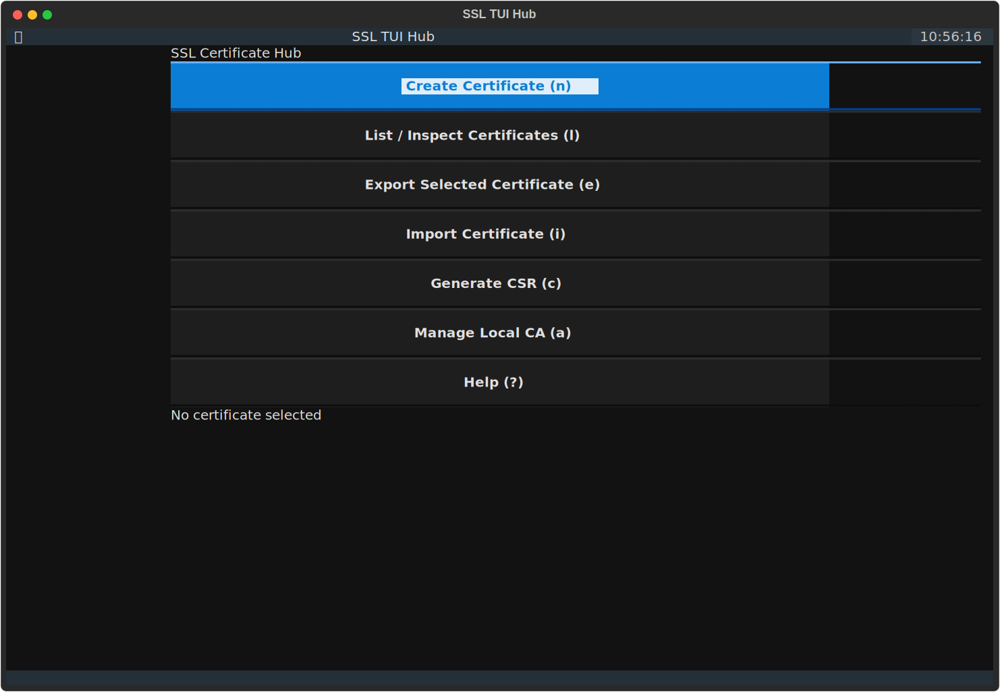
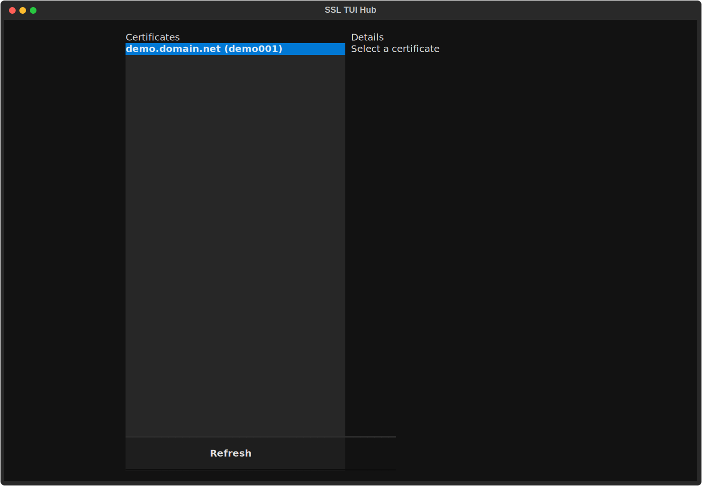

# SSLT

Terminal UI for SSL certificate creation, inspection, export, import, CSR generation, and local CA management.

## Requirements

- Python `3.12+`
- OpenSSL installed and available on `PATH`
  - Linux: usually `openssl` package
  - macOS: system OpenSSL-compatible binary or Homebrew OpenSSL
  - Windows: OpenSSL installation with `openssl.exe` on `PATH`
- Optional (recommended): `uv` for fast install/run workflows

## Installation

Use one of these options depending on how you want to consume releases.

### Install `uv` (recommended)

Linux/macOS:

```bash
curl -LsSf https://astral.sh/uv/install.sh | sh
```

Windows (PowerShell):

```powershell
powershell -ExecutionPolicy ByPass -c "irm https://astral.sh/uv/install.ps1 | iex"
```

Alternative methods are available in the official [`uv` docs](https://docs.astral.sh/uv/getting-started/installation/).

### Install SSLT from published releases

#### Option A: PyPI release (recommended once published)

```bash
uv tool install sslt
```

Run:

```bash
sslt
```

Upgrade later:

```bash
uv tool upgrade sslt
```

#### Option B: Install a specific release tag from GitHub

```bash
uv tool install "git+https://github.com/fivepoint-0/sslt@v0.1.0"
```

This is useful when you want to pin to an exact release tag.

#### Option C: pipx (isolated CLI install)

```bash
pipx install sslt
```

### Developer/local install

```bash
git clone https://github.com/fivepoint-0/sslt.git
cd sslt
uv sync
uv run sslt
```

## TUI Functions

SSLT home hotkeys:

- `n`: New certificate
- `l`: List/inspect certificates
- `e`: Export currently selected certificate
- `i`: Import certificate
- `c`: Generate CSR
- `a`: Manage local CA
- `?`: Help
- `q`: Quit

## Feature Screenshots

Quick preview:




Full gallery: [`docs/usage.md`](docs/usage.md)

To regenerate these images:

```bash
uv run python scripts/generate_docs_screenshots.py
```

### 1) Create Certificate (`n`)

Use this screen to:

- Create RSA certificates with key size `2048` or `4096`
- Set validity period (days)
- Choose signing mode:
  - `auto`: local CA if present, else self-signed
  - `self_signed`: always self-signed
  - `local_ca`: requires existing local CA
- Set subject fields (`O`, `OU`, `L`, `ST`, `C`)
- Add DNS SANs (comma-separated)
- Save current form fields as profile defaults

Create screen hotkeys:

- `Ctrl+S`: create certificate
- `F2`: save current fields as defaults
- `q`: back

### 2) List / Inspect Certificates (`l`)

Use this screen to:

- View all locally managed certificates
- Select a certificate and inspect metadata:
  - subject, issuer, serial
  - key size and signature algorithm
  - validity period and expiry status
  - SANs
  - SHA1/SHA256 fingerprints
- Choose a certificate as the active selection used by home-screen export
- Delete a certificate (with confirmation)

Details screen hotkeys:

- `Enter`: return selected certificate
- `e`: open export for selected certificate
- `x`: delete selected certificate (confirmation required)
- `r`: refresh list
- `q`: back

Delete confirmation hotkeys:

- `y`: confirm delete
- `n` / `q`: cancel

### 3) Export Certificate (`e`)

Use this screen to:

- Export selected certificate as:
  - `PEM`
  - `DER`
  - `PKCS#12 (.p12)`
- Choose destination directory
- Provide optional output filename
- Set optional PKCS#12 password

Export screen hotkeys:

- `Ctrl+S`: export
- `q`: back

### 4) Import Certificate (`i`)

Use this screen to:

- Import existing certificate files (`.pem/.crt/.cer/.der`)
- Optionally import matching private key file
- Optionally override display name/label

Import screen hotkeys:

- `F3`: import
- `q`: back

### 5) Generate CSR (`c`)

Use this screen to:

- Generate a CSR + private key pair
- Select RSA key size (`2048` or `4096`)
- Set subject fields (`O`, `OU`, `L`, `ST`, `C`)
- Add DNS SANs (comma-separated)

CSR screen hotkeys:

- `F4`: generate CSR
- `q`: back

### 6) Local CA Management (`a`)

Use this screen to:

- Create a local root CA certificate/key pair
- Install local CA trust into OS trust store
- Delete local CA artifacts
- View diagnostics:
  - local CA presence status
  - detected trust backend

Trust backend support:

- Linux: `update-ca-certificates`, `update-ca-trust`, or `trust` (p11-kit)
- macOS: `security` (System keychain)
- Windows: `certutil` (Root store)

Local CA screen hotkeys:

- `F5`: create local CA
- `F6`: install CA trust
- `F7`: delete local CA
- `q`: back

## Help Screen (`?`)

Shows all keybindings and quick usage guidance in-app.

## Versioning and Releases

SSLT uses dynamic versioning from Git tags via `hatch-vcs`.

- Do not manually edit package version in `pyproject.toml`.
- Development builds derive versions from commit history (for example, `0.1.devN+g<sha>`).
- Release versions come from Git tags in the form `vX.Y.Z` (for example, `v1.2.3`).

Release checklist:

1. Ensure `main` is green (tests and coverage passing).
2. Create and push a release tag (helper command):

```bash
make release VERSION=0.1.0
```

This helper validates:

- semantic version format
- clean git working tree
- no existing local/remote tag collision

Equivalent manual commands:

```bash
git tag v0.1.0
git push origin v0.1.0
```

3. GitHub Actions `Release` workflow will:
   - run tests on Ubuntu/macOS/Windows
   - run coverage
   - validate tag format
   - build distributions
   - publish to PyPI using `PYPI_PUBLISH_TOKEN`
   - create a GitHub Release with distribution artifacts

If a version is already on PyPI, publish will fail. In that case, create the next tag version and re-run release.

## Testing

- Unit/integration-style service tests:
  - `tests/test_cert_manager.py`
  - `tests/test_store.py`
- Textual interaction tests:
  - `tests/test_tui_flows.py`
- Run tests:

```bash
uv run pytest
```

## CI Badges

[](https://github.com/fivepoint-0/sslt/actions/workflows/tests-ubuntu.yml)
[](https://github.com/fivepoint-0/sslt/actions/workflows/tests-macos.yml)
[](https://github.com/fivepoint-0/sslt/actions/workflows/tests-windows.yml)
[](https://github.com/fivepoint-0/sslt/actions/workflows/coverage.yml)

## Coverage Reporting

Coverage is generated by `.github/workflows/coverage.yml` and published in two places:

- GitHub Actions step summary (`Coverage Report`)
- Workflow artifact named `coverage-report` containing:
  - `coverage.xml`
  - `coverage.md`
- Self-hosted badge file at `.github/badges/coverage.svg` (auto-updated on pushes to default branch)
- Last badge refresh timestamp at `.github/badges/coverage-updated.txt`
