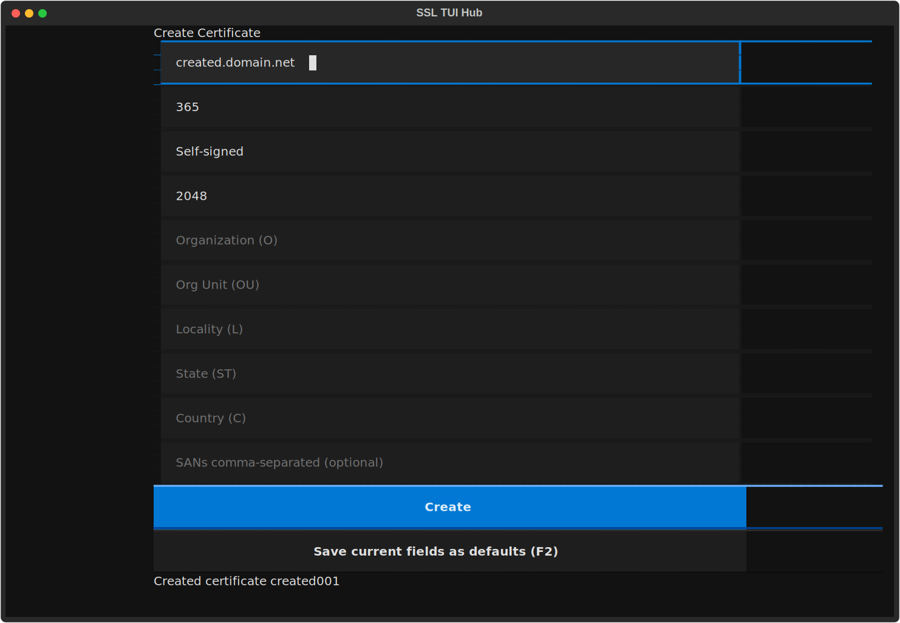
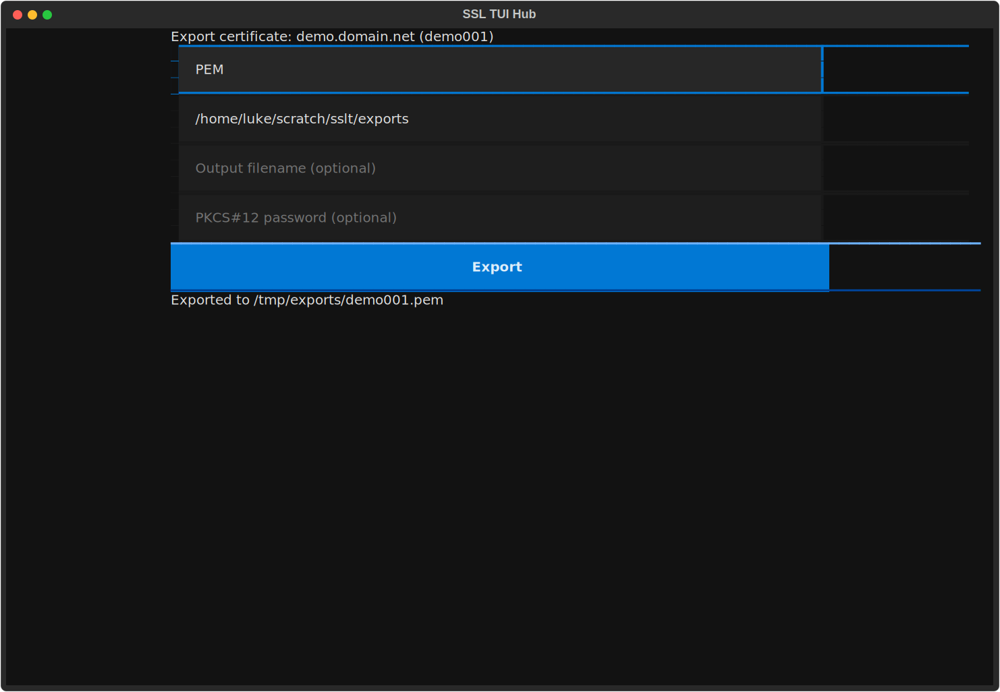
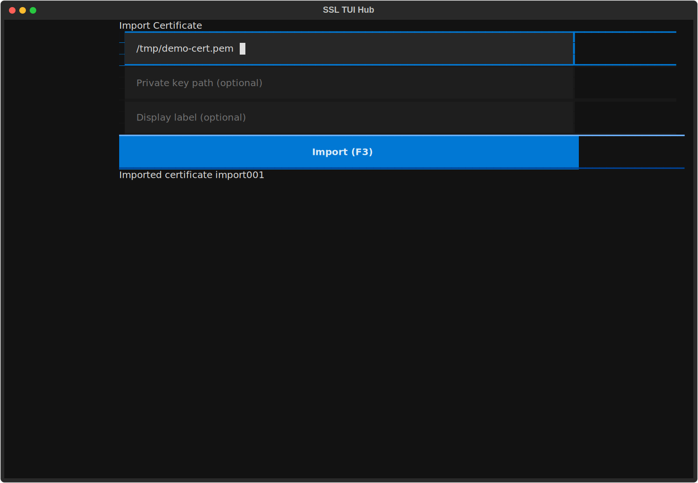
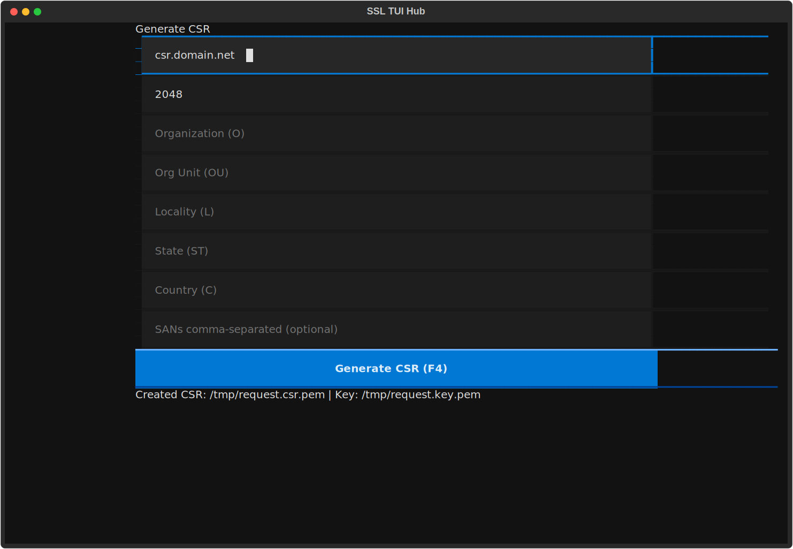
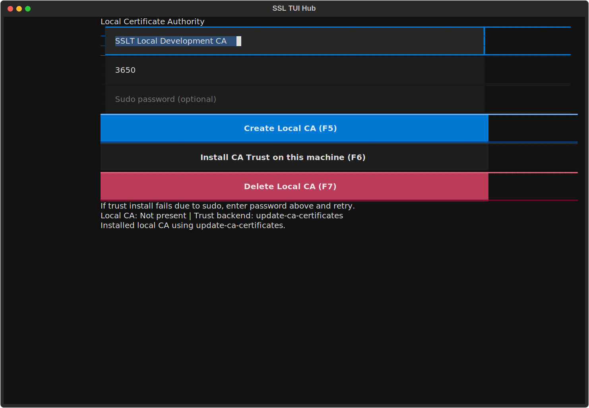
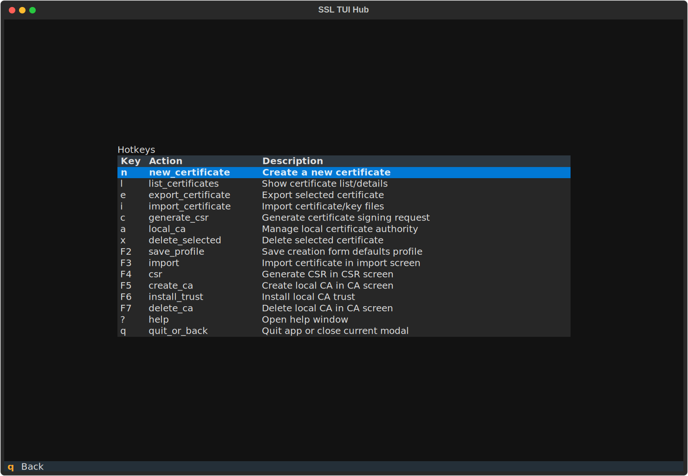

# SSLT Usage Gallery

This page captures each primary feature screen in SSLT.

## Home


## Create Certificate



## List / Inspect Certificates


## Export Certificate



## Import Certificate



## Generate CSR



## Local CA Management



## Help



## Regenerate

From the project root:

```bash
uv run python scripts/generate_docs_screenshots.py
```
